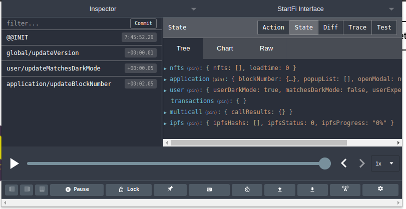
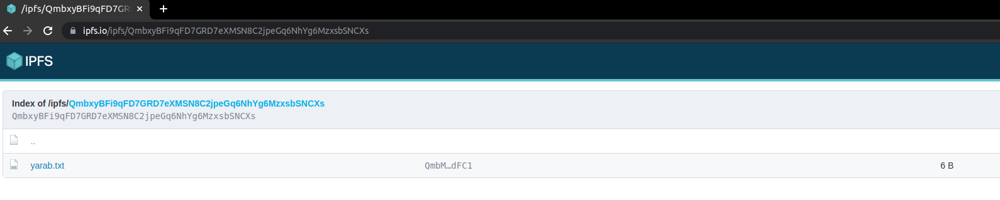
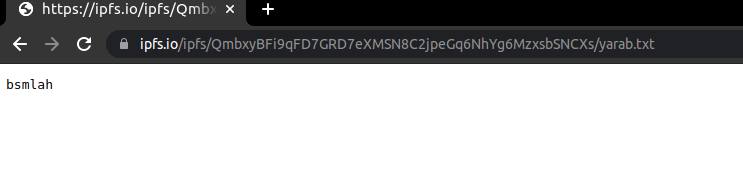

# IPFS Documentation

## Upload file

### Create media/file object

```
const media = {
  path: 'fileName.extension',
  content:
  | string
  | InstanceType<typeof String>
  | ArrayBufferView
  | ArrayBuffer
  | Blob
  | AwaitIterable<Uint8Array>
  | ReadableStream<Uint8Array>
}
```

### Use ipfs as a Service outside the react components

```
import {uploadIPFS,getDataIPFS} from 'src/services/Ipfs/Ipfs.tsx'

const mdeia = {fileName, content}
const hash = await uploadIPFS(mdeia)
```

### Use ipfs with hooks

```
import { useUploadToIpfs,useIpfsHashes,useIpfsStatus } from 'state/ipfs/hooks'

const mdeia = {fileName, content}
useUploadToIpfs(media)

useIpfsHashes() // get all uploaded hashes by the user (during the current session)

useIpfsStatus() // get user status
```

#### State management

Hooks method update our state.

Initial state
hashes: empty array of hashes
status: INIT, Loading, Done, Rejected
progress: 0% (In progress)


State after uploading a file

Initial state
hashes: empty array of hashes
status: INIT, Loading, Done, Rejected
progress: 0% (In progress)


## To check everything is working

enter the url: `https://ipfs.io/ipfs/<YourHash>/filename.extension`

### Exmaple

#### File location



https://ipfs.io/ipfs/QmbxyBFi9qFD7GRD7eXMSN8C2jpeGq6NhYg6MzxsbSNCXs/

#### File content


https://ipfs.io/ipfs/QmbxyBFi9qFD7GRD7eXMSN8C2jpeGq6NhYg6MzxsbSNCXs/yarab.txt


### Fetch Files

To fetch any file you need to use `getDataIpfs` service and send the file `path` as parameter

```
const uint8Array = await getDataIPFS(`${ipfsHash}/${file.name}`)
```
The returned value will be an `uint8Array`. To parse it to string for example we use `uint8arrays/to-string` package

```
import uint8ArrayToString from 'uint8arrays/to-string'
const uint8Array = await getDataIPFS(`${ipfsHash}/${file.name}`)
uint8ArrayToString(uint8Array) // return the content in string form
```